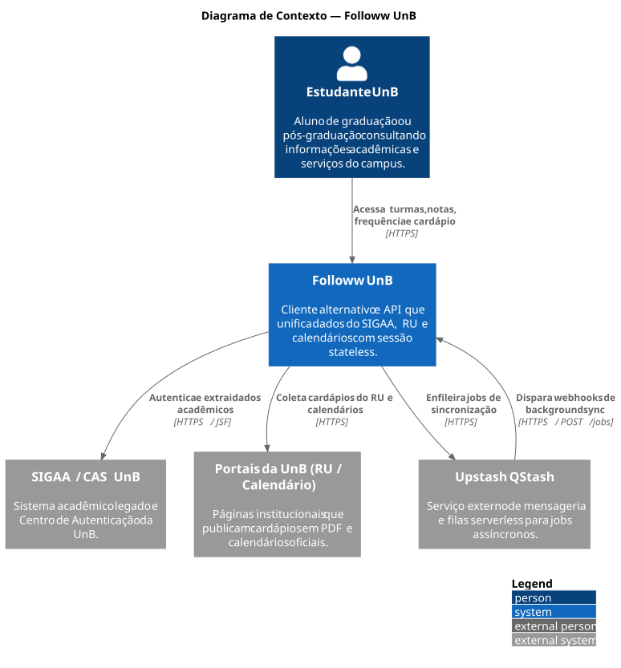
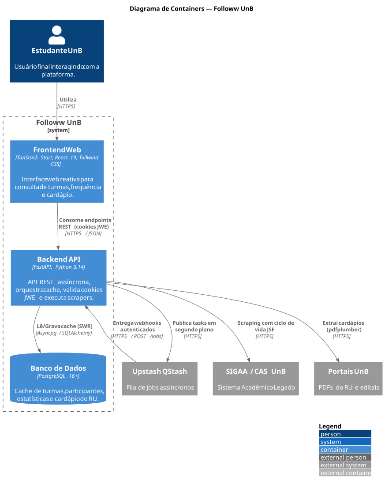
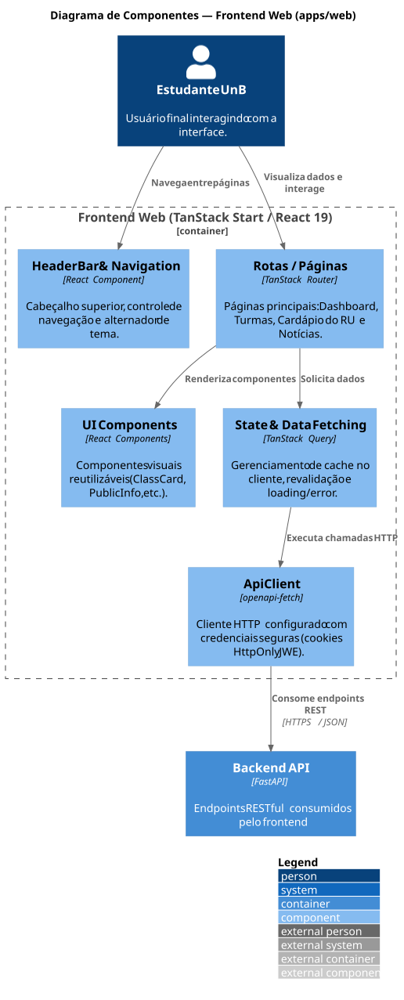
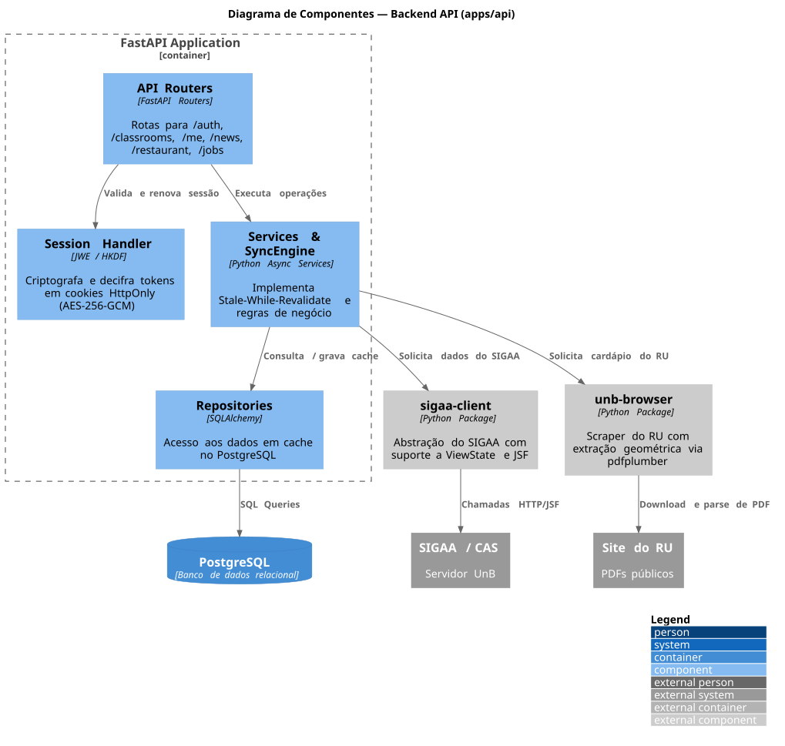

# Documento de Arquitetura — Followw UnB

## Introdução

### Finalidade
Este documento descreve a arquitetura de software do **Followw UnB**, apresentando uma visão abrangente do sistema por meio de múltiplos modelos arquiteturais (Modelo C4), padrões de projeto, decisões técnicas e organização do código.

### Escopo
O Followw UnB é um cliente alternativo e open-source para o ecossistema de sistemas acadêmicos da Universidade de Brasília (UnB), agregando em uma experiência unificada e performática dados do **SIGAA**, **Restaurante Universitário (RU)**, calendários e editais.

O sistema não possui contas proprietárias: a autenticação é delegada ao **Centro de Autenticação da UnB** e toda requisição para o SIGAA é *stateless*, com credenciais cifradas no cliente e sincronização assíncrona inteligente.

---

## Stack Tecnológica

| Camada / Função | Tecnologia | Justificativa |
| :--- | :--- | :--- |
| **Frontend Web** | TanStack Start (React 19 / Vite) | SSR/SPA unificado, tipagem estrita de rotas com TanStack Router e cache de estado via TanStack Query. |
| **Estilização** | Tailwind CSS v4 | Estilização utilitária atômica e performática. |
| **API Client (Web)** | `openapi-fetch` + `openapi-react-query` | Consumo type-safe sincronizado diretamente com o schema OpenAPI da API FastAPI. |
| **Backend API** | FastAPI (Python >= 3.14) | Assíncrono nativo, alta performance, geração automática de documentação OpenAPI e injeção de dependências robusta. |
| **Scraper SIGAA** | `sigaa-client` | Abstração que gerencia o ciclo de vida JSF (ViewState, postback), decodificação de PDFs e sessões CAS. |
| **Scraper Sites UnB**| `unb-browser` | Extração resiliente de cardápios do RU (parser geométrico via `pdfplumber`) e calendários acadêmicos. |
| **Banco de Dados** | PostgreSQL 16+ (SQLAlchemy assíncrono) | Armazenamento de cache de turmas, cardápios e participantes, com suporte a campos JSON estruturados. |
| **Fila Assíncrona** | Upstash QStash | Execução desacoplada de jobs de sincronização via webhooks autenticados, com *flow control* e deduplicação. |
| **Segurança/Sessão**| JWE (AES-256-GCM) + HKDF | Sessão *stateless*: token e credenciais residem em cookies HttpOnly cifrados; nenhuma senha persistida no servidor. |
| **Gerenciadores** | `uv` (monorepo Python) e `bun` (web) | Resolução instantânea de dependências e execução ultra-rápida. |

---

## Diagramas da Arquitetura (Modelo C4)
Os diagramas de arquitetura adotam o padrão de **Diagrams as Code** via **C4-PlantUML**, versionados como código em [`docs/diagrams/`](diagrams/) e renderizados em formato vetorial SVG localmente através do script [`scripts/generate_diagrams.py`](../scripts/generate_diagrams.py).

### Diagrama de Contexto do Sistema (Nível 1)
Apresenta o Followw UnB no seu ambiente operacional, seus usuários e as integrações com os sistemas da universidade e serviços externos.



> Código-fonte: [`docs/diagrams/context.puml`](diagrams/context.puml)

---

### Diagrama de Containers (Nível 2)
Detalha as aplicações executáveis, armazenamento de dados e fronteiras de comunicação entre componentes e serviços.



> Código-fonte: [`docs/diagrams/container.puml`](diagrams/container.puml)

---

### Diagrama de Componentes (Nível 3)
Apresenta a organização interna dos componentes do Frontend (`apps/web`), do Backend (`apps/api`) e suas interações com as bibliotecas do monorepo e dados.

#### Componentes do Frontend


> Código-fonte: [`docs/diagrams/components_frontend.puml`](diagrams/components_frontend.puml)

#### Componentes do Backend


> Código-fonte: [`docs/diagrams/components_backend.puml`](diagrams/components_backend.puml)


---

## Padrões Arquiteturais e Decisões de Design

### Sessão Stateless Criptografada (JWE)
- **Zero-Storage de Senhas**: A API do Followw não persiste credenciais nem sessões em disco ou banco de dados.
- **Cookies HttpOnly JWE**: A sessão é dividida em dois cookies protegidos por criptografia autenticada (`AES-256-GCM`), com chaves distintas derivadas via HKDF a partir de `JWT_SECRET_KEY`:
  - `access_token` (40 min): Sessão JSF ativa do SIGAA.
  - `refresh_token` (14 dias): Matrícula e senha encriptadas para renovação automática de sessão sem atrito para o usuário.

### Estratégia de Cache: Stale-While-Revalidate (SWR)
- Chamadas a dados custosos do SIGAA utilizam o `Sync.resolve(tarefa, alvo, load)` (`api/sync/`).
- Se o dado em cache estiver válido, ele é servido imediatamente.
- Se estiver expirado (*stale*), os dados do cache são servidos instantaneamente e a tarefa de sincronização entra num job do **QStash**, publicado antes da resposta.
- Sem cache, a requisição busca no SIGAA na hora, com a sessão do próprio usuário.

### Isolamento dos Scrapers em Pacotes Monorepo
- O parsing das páginas da UnB é completamente desacoplado da API REST em dois pacotes (`packages/sigaa-client` e `packages/unb-browser`).
- **Resiliência a JSF**: O `sigaa-client` trata ciclos de vida de `ViewState`, postbacks de menus laterais (`jscookMenu`) e a turma aberta, que é estado da sessão: requisições paralelas na mesma sessão podem trocá-la, e o client confere e reabre a turma antes de ler cada tela.
- **Extração geométrica de PDFs**: O `unb-browser` utiliza `pdfplumber` avaliando posicionamento espacial relativo para lidar com células mescladas e formatos variados entre os campi da UnB.

### Orquestração de Background Jobs (QStash)
- Operações lentas de sincronização são desacopladas da requisição síncrona do usuário.
- **Sessão efêmera por job**: o job nunca usa a sessão do usuário. Ele leva a credencial cifrada, faz login numa sessão própria do SIGAA, roda as tarefas e faz logout no fim. Sessões diferentes da mesma conta não interferem entre si.
- **Um job por turma**: a requisição junta as tarefas vencidas e publica um job por turma (e um da conta, com perfil e lista de turmas). O sync do login abre um job para cada turma com telas vencidas.
- **Paralelismo**: o *flow control* por matrícula (`parallelism: 4`) só poupa o CAS de rajadas de login; os jobs não disputam sessão.
- **Falhas**: uma tarefa que falha na origem não impede as outras e ganha uma única retentativa, com 1 min de espera. Senha recusada descarta o job.

---

## Estrutura de Diretórios do Projeto

```
.
├── apps/
│   ├── api/                   # Backend FastAPI
│   │   ├── api/
│   │   │   ├── core/          # Configurações e variáveis de ambiente
│   │   │   ├── db/            # Modelos SQLAlchemy e inicialização do banco
│   │   │   ├── modules/       # Uma pasta por feature: router, service e repository
│   │   │   ├── sync/          # Motor de cache (SWR), jobs do QStash e rota /jobs
│   │   │   ├── sigaa.py       # Conexão com o SIGAA da requisição
│   │   │   ├── cookies.py     # Cookies de sessão cifrados (JWE)
│   │   │   ├── cache.py       # Diretivas de Cache-Control
│   │   │   └── errors.py      # Erros do SIGAA e do RU traduzidos para HTTP
│   │   └── tests/             # Testes da API, um arquivo por módulo
│   │
│   └── web/                   # Frontend TanStack Start
│       └── src/
│           ├── components/    # Componentes React de interface
│           ├── queries/       # Clientes de API (openapi-fetch e queries tipadas)
│           └── routes/        # Rotas da aplicação (file-based routing)
│
├── packages/
│   ├── sigaa-client/          # Scraper e cliente assíncrono do SIGAA
│   └── unb-browser/           # Scraper do RU e calendários acadêmicos
│
├── docs/                      # Documentação de arquitetura, requisitos e sprints
│   ├── assets/                # Diagramas renderizados em SVG e imagens
│   └── diagrams/              # Diagramas como código em C4-PlantUML (.puml)
│
├── scripts/                   # Scripts utilitários locais (ex: geração de diagramas)
└── compose.yml                # Configuração do PostgreSQL local
```
